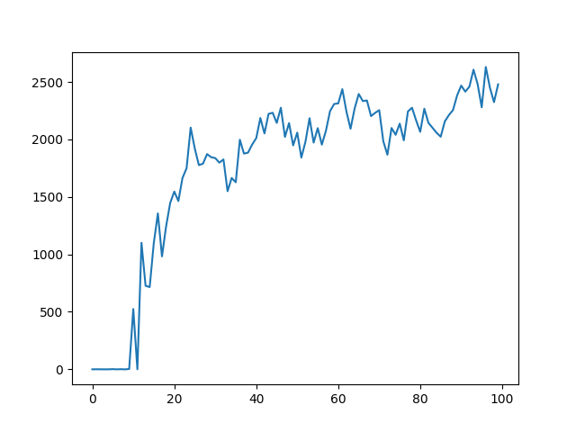
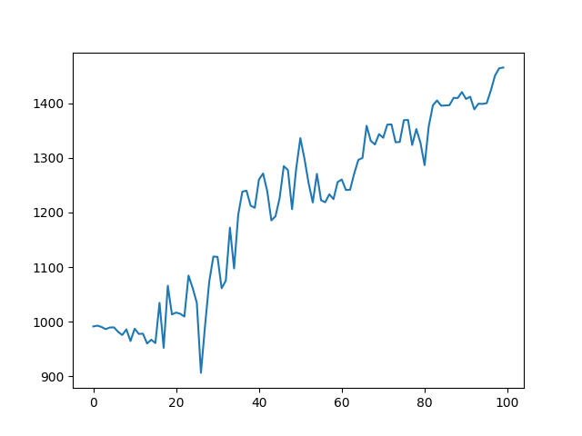
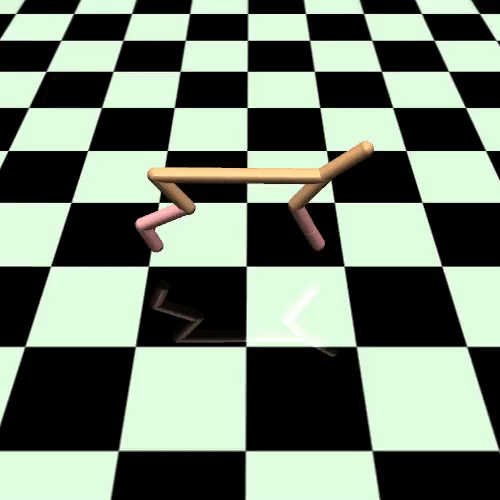

# Argumented Random Search

## Quick results:

(1 episode contains `2 * n_directions * horizon` environment updates)

### 100 episodes with **HalfCheetah_V1** [step_size=0.02, noise=0.03, n_directions=16, b=16, seed=1]:

(took ~10 min on Intel i5 core)

### 100 episodes with **Ant_V1** [step_size=0.015, noise=0.025, n_directions=60, b=20, seed=1]:

(took ~1 hour on Intel i5 core)

## Running cheetah demo (after 100 updates):

